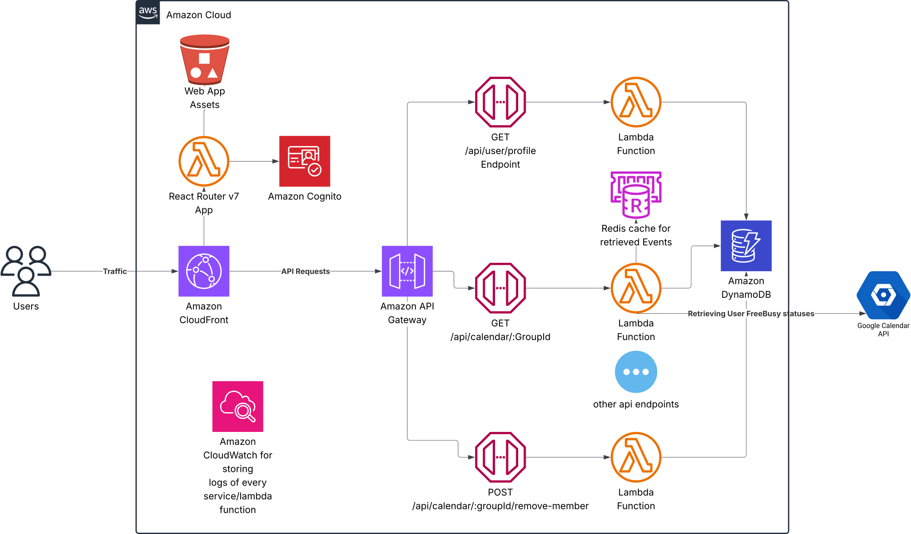

# Busy Bees

Cloud native app for finding free timeslot for your group.
It allows syncing calendars from different providers (Google, Apple, Microsoft Outlook...)
It is implemented using SST v3 framework, designed to be deployed on AWS.

**The problem it solves:**
Imagine you are assigned to a group project at university with a few people, now you need to find a time for a group meeting.
Using this tool all of you can see the schedules of the other persons visually, while preserving users privacy (not showing the details of the events) so you can find a perfect time for your meeting.
It automatically shows times where everybody is available.

_The app is being developed as a project for the Scalability Engineering module at Technische Universität Berlin_

## Architecture



The application follows a distributed serverless architecture designed for horizontal and vertical scalability.

## Features

### App Features

- Allows finding common free timeslot in big groups
- Free time slot finding between different calendar platforms (Google, Apple, Microsoft)
- Google Calendar support
- Microsoft Outlook support (planned)
- Apple Calendar support (through .ics urls)
- .ics files (planned)
- .ics urls (planned)

## Deployment

The project uses the SST v3 framework which allows easy deployment in the AWS cloud.

In order to deploy the project run:

```bash
npm install
npx sst deploy
```

## Development

For development SST framework allows easy development deployment.
Configure your aws cli first with your account and then run:

```bash
npx sst dev
```

> Additionally you need to create an application in the Google Cloud Console, enable Google Calendar API and get the required secrets
> GoogleClientId, GoogleClientSecret, GoogleRedirectUri

> You also need to have Vercel Access Token configured in your environment variables to deploy the dev and production stage.
> Vercel is used as domain provider and DNS as the domain is registered with Vercel.

## Scalability Engineering Requirements

This application was designed to meet specific scalability engineering requirements as part of the Technische Universität Berlin coursework.
The implementation demonstrates custom solutions without relying on external libraries to solve core scalability challenges.

### 1. State Management

The application manages distributed state across multiple components:

- **User State**: AWS Cognito handles user authentication and sessions
- **Calendar Data**: DynamoDB stores user profiles, OAuth tokens, and calendar events with composite keys (`groupId#YYYY-MM`) for efficient monthly queries
- **Session State**: Redis caching layer stores expensive Google Calendar API responses with 24-hour TTL
- **Application State**: React Router v7 manages client-side state with server-side rendering capabilities

**Custom Implementation**: State management is implemented without external state management libraries, using native AWS services and custom caching logic.

### 2. Vertical and Horizontal Scaling

**Vertical Scaling**:

- AWS Lambda functions automatically scale compute resources based on demand
- It is possible to add more resources to functions to make their execution faster
- DynamoDB auto-scaling adjusts read/write capacity units
- API Gateway handles increased request throughput

**Horizontal Scaling**:

- Serverless architecture enables automatic horizontal scaling through AWS Lambda concurrency
- Multiple Lambda function instances handle concurrent requests
- Separation of stateful components (database) from logic (lambda functions)
- Avoided using constantly running containers to reduce the cost when no users
- Current architecture allows to scale mostly to zero, taking almost no resources and costing close to zero when unused
- DynamoDB partitioning distributes data across multiple nodes

**Custom Implementation**: Scaling logic is built into the serverless architecture without using auto-scaling libraries.
The development has been focused on designing a system in such a way that it is able to scale through its architecture.

### 3. Load Mitigation Strategies

**Circuit Breaker Pattern**: Custom error handling in Lambda functions prevents cascade failures
**Rate Limiting**: API Gateway throttling prevents overwhelming downstream services
**Caching Strategy**: Redis layer reduces load on Google Calendar APIs with intelligent cache invalidation
**Database Connection Pooling**: Custom connection management for DynamoDB to prevent connection exhaustion

### 4. Additional Scalability Strategies

Based on presentation topics covered in the course, the application implements:

**Strategy 1 - Instrumenting Distributed Systems for Operational Visibility (Topic 11)**:

- Custom CloudWatch logging of log entries per unit of work (per request)
- Structured logging with request IDs for tracing
- Performance metrics collection for Lambda function execution times
- Error rate monitoring and alerting through CloudWatch dashboards

\*\*Strategy 2 - - Making Retries Safe with Idempotent APIs (Topic 4)

- All API endpoints designed with idempotency keys and safe retry patterns
- Sending a request to create a group twice or more times won't create many group calendars

**Strategy 3 - Caching Challenges and Strategies (Topic 5)**:

- Multi-layer caching with Redis for expensive Google Calendar API calls
- Cache invalidation strategies with 24-hour TTL for freebusy data
- Cache-aside pattern implementation with avoiding fallback
- Custom cache key generation: `freebusy:{authSub}:{timeMin}:{timeMax}`

**Additional Presentation Topics Implemented**:

- **Using Load Shedding to Avoid Overload (Topic 2)**: API Gateway throttling and Lambda concurrency limits

**Custom Implementation Justification**:
The application deliberately avoids using external libraries for core scalability challenges to demonstrate understanding of distributed systems principles.
This includes:

- **Serverless Functions**: All 'backend' logic is implemented using functions which require no state, thus allowing horizontal scalability
- **Separation of stateful services**: Services that are stateful (database, cache) are moved outside of the backend logic
- **No ORM Libraries**: Direct DynamoDB SDK usage for optimal query patterns that allow idempotency
- **No Caching Libraries**: Custom wrapper around Redis implementation with application-specific logic
- **No Load Balancing Libraries**: Reliance on AWS native services with custom configuration in infrastructure as code
- **No State Management Libraries**: Custom state handling patterns in React components

## Learn more

More information about the project can be found in [`docs/`](https://github.com/erykksc/busybees/tree/main/docs)
